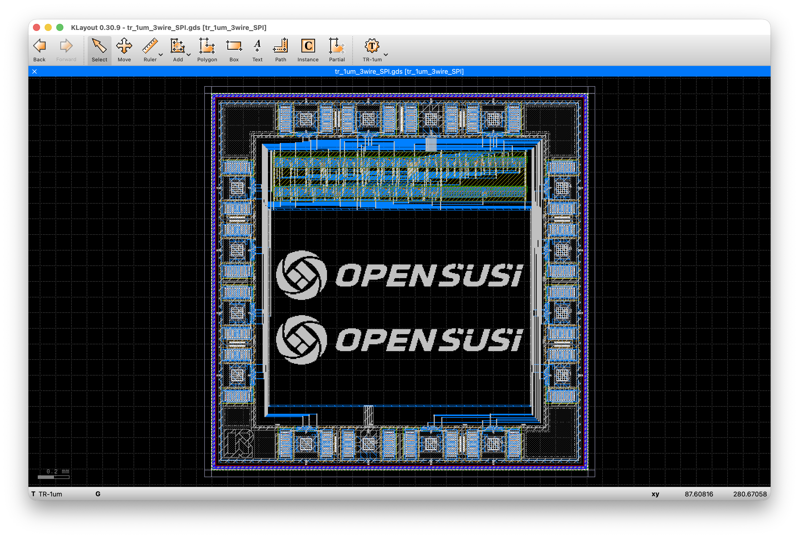

# TR-1um 3-Wire (Half-Duplex) SPI Slave

[](../../actions)

SCLK-domain synchronous **3-wire (half-duplex) SPI slave** on the OpenSUSI
TR-1um process. Mode 0, MSB first, one 8-bit frame per chip select. MOSI and
MISO are merged onto a single `SDIO` pin, and the frame direction is set by an
external `DIS` pin rather than by a command byte — the same pin that sets the
direction of the shared `DATA[7:0]` pads.

The external data interface (`DATA[7:0]` + `DIS` + `RSTN`) is deliberately
identical to [`TR-1um_Async_I2C`](https://github.com/jun1okamura/TR-1um_Async_I2C);
only the serial protocol layer differs, so the same board and the same test
fixture drive either chip.

- 設計の全記録: [`design_notes.md`](./design_notes.md)
- `scripts/` 配下の各スクリプトの役割: [`scripts/SCRIPTS.md`](./scripts/SCRIPTS.md)
- ピン配置表(生成物): [`docs/pin_list.md`](./docs/pin_list.md)

---

## 1. チップ概要(ピン説明)

`OSS_FRAME_GIO` の16本の実ボンドパッド(P1〜P7、VSS、P9〜P15、VDD)。
**P8 はこのフレームに存在しない。**

| ピン | 信号 | 方向 | 説明 |
|---|---|---|---|
| P1 | `SCLK` | 入力 | SPIクロック。**本コア唯一のクロック源** |
| P2 | `SDIO` | 双方向 | 半二重データ。出力は`sdio_oe_n`(アクティブLOW)でゲートされ、READフレームで`CS`がLowの間だけチップが駆動 |
| P3 | `CS` | 入力(負論理) | チップセレクト。フレーム境界を規定し、ビットカウンタを非同期クリア |
| P4 | `TEST` | 出力(常時駆動) | `byte_end` — フレーム第8ビット期間中High |
| P5 | `DIS` | 入力 | フレーム方向 + `DATA[7:0]`の方向制御(8本共有) |
| P6 | `DATA[0]` | 双方向 | `tx_data[0]` / `rx_data[0]` |
| P7 | `DATA[1]` | 双方向 | `tx_data[1]` / `rx_data[1]` |
| VSS | `VSS` | 接地 | 0 V |
| P9〜P14 | `DATA[2]`〜`DATA[7]` | 双方向 | `tx_data[2..7]` / `rx_data[2..7]` |
| P15 | `RSTN` | 入力(負論理) | 非同期リセット |
| VDD | `VDD` | 電源 | 5.0 V系 |

`DIS` がフレームの向きと `DATA[7:0]` パッドの向きを同時に決めるので、
**R/Wビットもコマンドバイトも要らない**:

| `DIS` | フレーム | `SDIO` | `DATA[7:0]` | 動作 |
|:---:|---|---|---|---|
| 0 | WRITE | 入力(マスタが駆動) | **チップが駆動** | 受信バイトを `rx_data` に確定し DATA へ出力 |
| 1 | READ | **チップが駆動**(CS=Low中) | 入力(`tx_data`) | DATA を取り込み SDIO へ MSB から送出 |

物理パッド番号の昇順とbit番号が単調対応する(P6/P7 = bit0-1、P9〜P14 = bit2-7)。
基板を配線するときの並び(ダイを表から見て左上から時計回り)と、
`HIZ` 極性の詳細は [`docs/pin_list.md`](./docs/pin_list.md) を参照。
Raspberry Pi から `spidev` で叩くときの結線とレベル変換は
`design_notes.md` §10。

> **`HIZ` の極性に注意**: `OSS_ESD_5V_DIO` は `HIZ=0` で出力ドライバON。
> DATA 8本の `HIZ` は `DIS` パッドの網に直結してあり(`data_oe = ~dis` と
> 過不足なく一致するので論理が要らない)、SDIO はコアがアクティブLOWの
> `sdio_oe_n` を出すので同じく直結。**チップトップに追加セルは1個も無い**
> (`design_notes.md` §16.5〜16.6)。

## 2. チップ概要



<!-- TODO: docs/Chip_Image.png を差し替える(KLayoutのチップ全体スクリーンショット) -->

- プロセス: OpenSUSI TR-1um、5.0 V系
- チップサイズ: 2.5 mm × 2.5 mm、`OSS_FRAME_GIO` 16パッド
- 構成: **SPIスレーブコア1個のみ**(リング発振器・ロゴ等の追加構造は無し)
- コア `spi_slave_sclk_nrow_fm`: 1,632.6 × 314.1 µm = 0.513 mm²、2行構成
- 規模(配置配線したネットリスト `layout/spi_slave_sclk_net_pnr.v`):
  **41セル / 844トランジスタ / 211等価ゲート**(NAND2 = 4 Tr = 1ゲート)、
  記憶素子20個
- 配線チャネル: 上 90 µm / 下 80 µm / 左右 103.7 µm

| フェーズ | 状態 |
|---|---|
| RTL設計・機能検証 | 完了。12本のテストベンチ / 187チェック × 3ビュー = **561チェック / 36ラン 全PASS** |
| 論理合成(Yosys + ABC) | 完了。49セル / 796 Tr / 199等価ゲート |
| 合成後加工(MUXDFFRB統合 → BUFTH挿入 → 行バッファ挿入) | 完了。**41セル / 844 Tr / 211等価ゲート** |
| コアの配置配線(2行 nrow + FM分割) | 完了。**DRC 0違反・短絡0・25ポート全て引き出し** |
| コア単体 DRC / LVS(実機KLayout) | **クリーン**(この時点で残っていたANTはGIO統合後に解消) |
| GIOフレームへの統合とトップ配線 | 完了。信号24ネット + 電源、**新規DRC 0・断線0・短絡0** |
| チップ全体 DRC / LVS(実機KLayout) | **クリーン** |
| ngspice トランジスタレベル検証(チップ全体) | **12チェック / 54 measure 全PASS**。参照ネットリスト・抽出ネットリストの両方 |
| 通信速度の実測 | 完了。**推奨最大 SCLK 10 MHz**(7節) |
| MPW提出用エクスポート | **未着手**(`src/` はまだテンプレートのまま) |

## 3. 回路設計

RTL → 機能検証 → 論理合成 → **同じテストベンチでのゲートレベル再検証**、
という2段階の検証フロー。

- **RTL**: [`hdl/spi_slave_sclk.v`](./hdl/spi_slave_sclk.v)。半二重なので
  **シフトレジスタが1本で済む**のが構成上の要点で、`shift_clk = sclk ^ dis`
  により WRITE では立ち上がり、READ では立ち下がりで動く。Mode 0 が要求する
  「立ち下がりで出力を変え、立ち上がりでサンプルする」を1本のレジスタで満たす。
- **MSBの扱い**: Mode 0 は最初の立ち上がりより前にMSBが確定している必要がある
  — つまりクロックエッジが1つも無い時点で。MSBだけ `tx_data[7]` から直接出し、
  以降を `sr[7]` から出す選択を `shift_clk` で叩いた `msb_done` で行うことで、
  **SDIOの遷移を全て立ち下がりエッジに閉じ込めている**(`bit_cnt == 0` で直接
  選ぶと第1・第8の立ち上がりでSDIOが動いてしまい、Mode 0 違反かつマスタの
  ホールド余裕を削る)。
- **RTL検証(1段目)**: 12本のテストベンチ(`hdl/tb_01`〜`tb_12`)。
  リセット・WRITE・READ・ビット順・Mode 0タイミング・トライステート・
  アイドル・マルチバイト・クロックレート・ランダム・Linux `spidev` 相当の
  シーケンス・チップレベル結線、で187チェック。
- **論理合成**: Yosys + ABC。Liberty はLEFのMACRO面積から生成した実面積版
  (`lef/TR1um_5_stdcell_area.lib`)を使う。
- **NET検証(2段目)**: 合成直後NET・P&R用NET(BUFTH/行バッファ挿入後)に対して
  **RTLと同一のテストベンチ**を再実行し、3ビュー全てが一致することを確認
  (`scripts/run_tests.sh`、36ラン全PASS)。

## 4. AP&R

`TR-1um_5_stdcell` によるスタンダードセルベースの配置配線。すべて
`scripts/` 配下の自作Pythonフローで、RTLから再現できる。

- **配置**: nrow(複数行)構成。行幅を **I2C版と同じ 1,620 µm に固定**した上で
  (GIO⇔コアの結線枠組みをそのまま引き継げるため)、行間のクロスネットを
  最小化するFiduccia-Mattheysesハイパーグラフ分割で行割り当てを決める。
  2行構成のセル総幅 2,251.8 µm は1行(1,620 µm)には収まらないので
  **2行が最小**。
- **配線**: 独自ルータによる多パス方式(TAP電源メッシュ → 行内ローカル →
  高ファンアウト/隣接ペア → 行またぎ → 強制ジョグ)＋リップアップ&リルート。
- **後処理**: 再配線せず、真に未使用な配線トラックだけを幾何学的に除去して
  チャネル高さを圧縮。全トップレベルポートをコアBBOX端まで引き出し、
  M1PIN/M2PINマーカーを配置。
- **チップ統合**: コアを `OSS_FRAME_GIO` の (-810.0, 515.9) に配置し、
  **リング側32端子とコア側24ピンを24ネットで結線**(`scripts/route_chip.py`)。
  リングの端子は全部で42本あり、残りは `HIZ` 5本を電源へ固定、未使用の
  `OUT` 4本を同じ辺のGND端子へ落とし、出力専用パッド `P4` の入力側は
  使わない。コアの25ポートのうち `data_oe` だけはパッドを持たない
  (`~dis` と同じ情報で、使う側は全て `DIS` パッドの網から取っている)。
  リング配線エンジンはI2C版から逐語コピーで、本設計固有なのは
  **コア下(U)コリドー** — PTECTキープアウトに塞がれた下端ピン11本を横へ
  逃がす経路で、逃がす向きは全探索で決める。

## 5. DRC/LVS

- **DRC**: 自作チェッカー(M1/M2の幅・スペース、V1関連)に加え、
  チップ配線では**配線前後の両方でDRCを走らせて増えた分だけを報告**する
  (パッドリングは元からマーカーを数個持っているため)。実機KLayoutの
  実DRCデックでも独立に確認し、コア単体・チップ全体とも**0違反**。
  コア単体の時点では配線長依存のANT(アンテナ)指摘だけが残っていたが、
  これはGIO統合後の再確認で解消済み。
  PTECT(63/1)キープアウト内の金属も別途0件を確認。
- **LVS**: 参照ネットリスト(SPICE)は手書きではなく、**機能検証済みの
  ゲートレベルNET**とGIO⇔コア結線マップから機械生成する
  (`scripts/gen_lvs_spice.py` / `gen_lvs_spice_top.py`)。つまりLVSが参照する
  回路は、3節で検証したのと**同一のNET**であることが構造的に保証されている。
  セルのトランジスタ実体はxschemの実exportと13セル分照合済み。
  実機KLayoutで、コア単体・チップ全体とも**LVSクリーン**。

## 6. SPICE(ngspice)チップレベル検証

3ビューの論理シミュレーションはどれもパッドセルをVerilogの `1'bz` に
置き換えている。ここが初めて `OSS_ESD_5V_DIO` の実体を通す工程で、
パッドの極性・ドライバの喧嘩・レールまで届かないレベルを捕まえられる。

SCLK 1 MHz / Mode 0 / MSBファーストで3フレーム連続:
**WRITE `0xA5` → READ `0x3D` → WRITE `0x5A`**。双方向パッドは電圧制御
スイッチ越しに駆動して、どの瞬間も片側しか駆動しない。`.tran` の
**Tmax = 1 ns**(50 nsでは10 ns未満のセットアップ余裕を解像できず、
ngspiceの適応ステップ制御が誤った側に丸める。I2C版で実測済み)。

**12チェック / 54 measure 全PASS**(TBはこの他に判定しない計測を4本持つので
`.measure` は全58本。7節の clock-to-out がそれ)。同じDATAパッド8本の上を
`0x00` → `0xA5` → `0x3D` → `0xA5` → `0x5A` と4通りの相異なるパターンが通り、
レベルは全てレールに達している。

同じTBを**レイアウト抽出ネットリスト**(KLayoutのLVS抽出、各素子が実測の
`AS`/`AD`/`PS`/`PD` を持つ)に対しても流し、こちらも**12/12 PASS**。
判定値の差は最大 0.69 mV。

## 7. 通信速度

`scripts/sweep_sclk.py` が同じ12チェックを周波数軸に沿って上げていき、
壊れる周波数を探す。実測(抽出ネットリスト / typical / 5.0 V / 27 °C):

| | 外部負荷なし | 20 pF |
|---|---|---|
| `tco_sdio`(SCLK↓ → SDIO 有効) | **30.7 ns** | **34.4 ns** |
| `tco_data`(SCLK↑ → DATA 有効) | 21.5 ns | 25.2 ns |
| 12チェックが通る上限 | **16 MHz** | 15 MHz(マスタ100 Ω) |
| コア + 入力経路だけの限界 | **32 MHz** | — |

Mode 0 ではチップは立ち下がりでSDIOを変え、マスタは次の立ち上がり=**半周期後**に
サンプルするので `f_max ≈ 1 / (2 × tco_sdio)`。負荷なしで 16.3 MHz となり、
実測の「16 MHz通過 / 17 MHz失敗」と一致する。**律速は出力経路だけ**で、
シフトレジスタ・ビットカウンタ・入力経路は 32 MHz まで動く。

20 pF側の上限にマスタのインピーダンスが付くのは、TB側マスタが 1 kΩ 直列だと
20 pF と組んで時定数20 nsになり、**チップより先にTBが律速する**ため
(1 kΩのままだと12 MHzで止まる)。測っているのが部品か測定系かを分けられる
ようにしてある。

> **推奨最大 SCLK = 10 MHz**(5.0 V、パッド負荷20 pFまで、マスタのセットアップ
> 10 ns確保)。typicalモデル・27 °C での値で、プロセス/温度コーナーは
> 振っていない。

## 8. 構成

```
hdl/
  spi_slave_sclk.v           RTL本体(SCLKドメイン同期、単発8bitフレーム)
  tr_1um_3wire_SPI.v         チップトップのシミュレーションモデル(パッド込み)
  tb_01..tb_12               テストベンチ12本(187チェック)
  cells_sim.v                標準セルのビヘイビアモデル(ゲートレベル検証用)
  spi_tb_common.vh           テストベンチ共通のチェックマクロ
layout/
  spi_slave_sclk_net*.v      合成〜P&R用の各段のネットリスト
  spi_slave_sclk_nrow_fm.spice
                             コアのLVS参照ネットリスト(機械生成)
  step1..step10/             配置配線の各STEPのチェックポイントGDS
  chip/                      チップ統合の成果物
    step1_assembled.gds        コア+リング+PTECT(配置のみ)
    step2_routed.gds           トップ配線後
    step3_top_pins.gds         ボンドパッドにLVSピンを追加(最終)
    tr_1um_3wire_SPI.spice     チップレベルLVS参照ネットリスト
    tr_1um_3wire_SPI.extracted KLayoutのLVS抽出ネットリスト
    gio_connections.json       パッド⇔コア結線マップ(一次データ)
    signal_routing_plan.json   ルータ用の実座標
ngspice/
  tr_1um_3wire_SPI_sim_ready.spice        参照ネットリスト(ngspice用)
  tr_1um_3wire_SPI_extracted_sim.spice    抽出ネットリスト(ngspice用)
  tb_chip_spi.spice / tb_chip_spi_extracted.spice
                             チップレベルTB(+ 期待値JSON)
  spice_chip*.log            実機ngspiceのログ(12/12 PASSの現物)
lef/
  TR-1um_STDCELL.gds/.lef    標準セルライブラリ
  TR-1um_STDCELL.spice       セルのトランジスタ実体(LVS参照の部品)
  TR-1um_frame_25x25.gds     パッドフレーム(`OSS_FRAME_GIO`)
  OSS_FRAME_GIO.spice        パッドリングのトランジスタ実体
  TR1um_5_stdcell_area.lib   実面積版Liberty(合成用)
  cell_info.json             セル一覧(面積・Tr数・論理関数)
scripts/
  build.sh / run_tests.sh    エントリポイント
  ...                        合成・配置・配線・DRC/LVS・ngspice検証の一式
  i2c_ref/                   I2C版の原本(無改変。移植の基準として保持)
  SCRIPTS.md                 各スクリプトの役割と使いどころ
docs/
  pin_list.md                ピン配置表(生成物)
  cell_usage.md              STDCELL利用リスト(生成物)
src/                         MPW提出用(未着手 — テンプレートのまま)
info.yaml                    MPWプロジェクト設定(`gds.top_cell` = tr_1um_3wire_SPI)
design_notes.md              設計ノート本体
```

## 9. 実行方法

### RTL〜配置配線用ネットリスト

```sh
scripts/build.sh                          # 合成 → MUXDFFRB統合 → BUFTH挿入 → 行バッファ挿入
scripts/run_tests.sh                      # 全12テストベンチ × 3ビュー = 36ラン
DUMP=1 scripts/run_tests.sh tb_05_mode0   # 波形付きで1本だけ
```

### コアの配置配線

```sh
scripts/place.py             # nrow配置(FM分割 → 行内順序 → TAP → FILL)
scripts/verify_placement.py  # 被覆・アバット・トラックグリッド・TAP位置の検証
scripts/route.py             # step5〜step10 + DRC/接続性チェック
scripts/route.py --from 6 --to 6   # 配線だけやり直す
```

行バッファを実配置ベースで入れ直す**2パス**が正規の手順(`SCRIPTS.md` §3)。
`route.py` は先頭で配置JSONをルータ用スキーマへ変換し直すので、
前の設計の配置で走ってしまう事故が起きない(`design_notes.md` §16.8)。

### チップ統合とトップ配線

```sh
scripts/assemble_top.py            # コア + リング + PTECT を配置
scripts/gen_top_routing_plan.py    # 結線マップと配線プランを生成
scripts/route_chip.py              # トップ配線
scripts/add_top_pins.py            # ボンドパッドにLVSピン
scripts/gen_lvs_spice_top.py       # チップレベルLVS参照ネットリスト
scripts/check_chip.py              # DRC差分・PTECT・接続性・電源・参照との突き合わせ
scripts/pin_list.py                # docs/pin_list.md
```

### ngspice チップレベル検証

```sh
scripts/gen_chip_sim_ready.py      # LVS参照ネットリスト → ngspice用
scripts/gen_sim_from_extracted.py  # 抽出ネットリスト  → ngspice用
scripts/gen_chip_tb.py             # TB + 期待値JSON
cd ngspice && ngspice -b tb_chip_spi.spice > spice_chip.log 2>&1 && cd ..
scripts/check_chip_sim.py ngspice/spice_chip.log
```

### 通信速度の掃引

```sh
scripts/sweep_sclk.py                                    # 既定のはしご(1〜30 MHz)
scripts/sweep_sclk.py -f 13,14,15 --load-pf 20 --master-ohm 100
```

## 10. MPW提出

`info.yaml` の `gds.top_cell` は `tr_1um_3wire_SPI`。提出物
(`src/<top_cell>.gds` / `.cir`)は**まだ生成していない** — `src/` には
テンプレート同梱の `tr_1um_username.*` が残っている。生成後は
GitHub Actions(`.github/workflows/check.yml`)が Pre-check / DRC / LVS / MDP を
自動実行する。設定項目の詳細は [`docs/info.md`](./docs/info.md)。

## 11. 参考

設計・実装の全記録は [`design_notes.md`](./design_notes.md)。主な区切り:

| 節 | 内容 |
|---|---|
| §1〜4 | 仕様、ピン割り当て、アーキテクチャ、RTL検証(187チェック) |
| §5〜9 | ゲート規模、I2C版との比較、見積もり履歴、設計上の注意点、ディレクトリ構成 |
| §10 | **Raspberry Pi からの接続**(Pi 4以前 / チップ3V動作、`spidev` での叩き方) |
| §11 | STDCELLへの追加提案 |
| §12〜13 | 行数の検討と nrow 配置(FM分割) |
| §14 | チャネル配線、トップピン引き出し、STDCELL利用リスト |
| §15 | LVS用ネットリストの生成と実機LVSクリーン化(コア単体) |
| §16 | GIOフレームへのコア配置、`HIZ` 極性、`sdio_oe_n` のアクティブLOW化 |
| §17 | トップレベル配線(U コリドー、電源、ボンドパッドのLVSピン)と検証 |
| §18 | ngspice チップレベル検証、抽出ネットリストでの再実行、**通信速度の実測** |
| §19 | 次のステップ(残りはMPWエクスポートのみ) |

移植方針(I2C版の原本を `scripts/i2c_ref/` に無改変で置き、
`port_i2c_scripts.py` で機械的に移植する)は
[`scripts/PORTING.md`](./scripts/PORTING.md) を参照。
